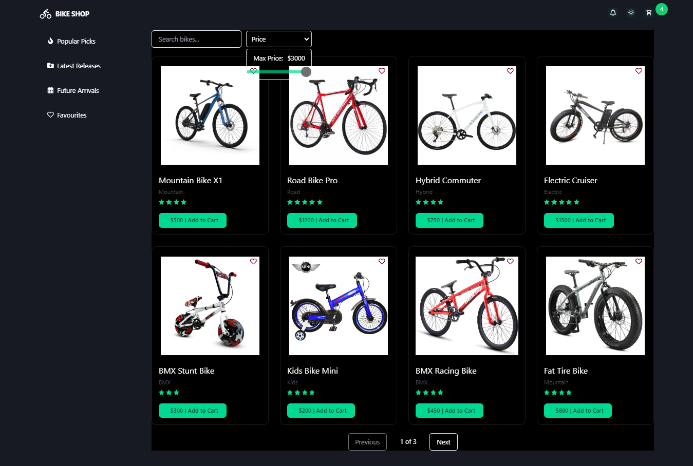

# BikeShopApplication

# BikeShop
BikeShop is a modern e-commerce platform designed for bike enthusiasts to explore, purchase, and manage their favourite bicycles. 
This application allows users to browse various bike categories, view detailed product information, add bikes to a shopping cart. 
With a focus on user experience and functionality, BikeShop aims to provide a great shopping experience for cyclists of all levels.

## Link
https://bike-shop-application.netlify.app/

## Screenshot of My site

# Features
## Must-Have Features
Theme Toggle Button:
1. Implement a toggle button to switch between light and dark themes for user preference.

### Navigation Options:
1. Home: Showcase featured bikes and promotions.
2. Category: Display bikes categorised by type (e.g., mountain bikes, road bikes).
3. Favourites: Allow users to save their favourite bikes for easy access.
4. New Releases and Trending: Highlight new arrivals and popular bikes.

### Favorite Bikes:
1.Enable users to mark bikes as favourites and save them for future reference.

### Responsive Design Enhancements:
1.Optimise the application layout for various devices, ensuring usability on mobile, tablet, and desktop screens.
2.Implement fluid design elements and breakpoints for a greate UI/UX across devices.

### Loading functionality :
1.Opening the landing page, linking to different routes, adding Bike to the cart

### Cart Management:
1. Implement a shopping cart to store selected bikes.
3. Allow users to add, remove, or update quantities of bikes in the cart.
   
### Search Functionality:
1. Include a search bar to allow users to search for bikes by name or category.
   
### Filtering Options:
1. Enable filtering by price range, bike type, brand, or other relevant attributes.
2. Apply filters to refine search results dynamically.
   
## Nice-to-Have Features

User Authentication and Profile Management:
1. Implement user authentication using Firebase Authentication or a similar service.
2. Allow users to create accounts, log in, and manage their profiles.
3. Store favourite bikes and order history securely tied to user accounts.

Product Reviews and Ratings:
1. Enable users to leave reviews and ratings for bikes.
2. Display average ratings and reviews on product detail pages to help other users make informed decisions.

Pagination for Product Listings:
1. Implement pagination to manage large lists of bikes, improving performance and user experience.

Advanced Filtering and Sorting:
1. Expand filtering options to include advanced criteria such as color, size, gears, etc.
2. Allow users to sort search results by relevance, price, popularity, or other factors.

Real-Time Updates:
1. Use WebSocket or similar technology to provide real-time updates on product availability, price changes, or new arrivals.
2. Implement instant search suggestions as users type.

## Technologies used
1. React
2. CSS Tailwind
3. Cypress for testing
4. Netlify for deployment

## Company Brand/Design
· Brand Name: BikeShop
Colors
 #00D991 (Green), #171923 (Black Pearl) with general colors of Black and White.
